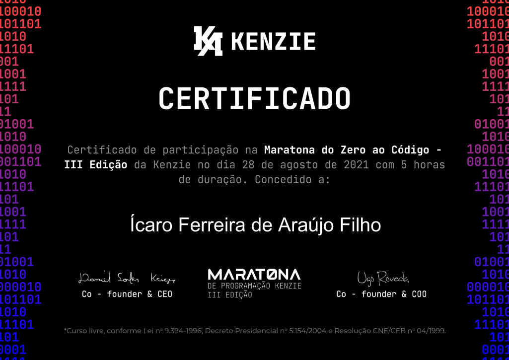

<header align="center">
    
    <h1>Hi, I'm Ícaro Ferreira</h1>
</header>

<!-- About ME -->
<section>
    <h2>About me</h2>
    <ul>
        <li>Bachelor of Aeronautical Science</li>
        <li>FullStack student at SENAI <a href="https://cursos.sesisenai.org.br/detalhes/devinhouse/25558">[DEVinHouse]</a></li>
        <li>Python Dev student at <a href="https://www.bylearn.com.br/">ByLearn</a></li>
        <li>Student mentor at <a href="https://www.estudonauta.com/">ESTUDONAUTA.COM </a>'s forum <small>(helping others student to code)</small></li>
        <li>Advanced English</li>
    </ul>
    

</section>

<!-- Skills -->
<section>
    <h2>Skills</h2>
    <!-- BASIC -->
    <ul>
        <li>
            <h4><strong>BASIC</strong></h4>
            <table style="text-align: center">
                <th>HTML5</th>
                <th>CSS3</th>
                <th>JScript</th>
                <th>C#</th>
                <th>MySQL</th>
                <th>Postgre</th>
                <tr>
                <td></td>
                <td></td>
                <td></td>
                <td></td>
                <td></td>
                <td></td>
                </tr>
            </table>
        </li>
        <li>
            <h4><strong>INTERMEDIATE</strong></h4>
            <table>
                <th>Python</th>
                <tr>
                <td></td>
                </tr>
            </table>
        </li>
    </ul>
    

        
    

</section>
<!-- FIND ME AROUND THE WORLD -->
<section>
    <h2>Find me around the world</h2>
    <ul>
        <li><h4><strong>SOCIAL MEDIA</strong> 
        </h4>
            
            
            
            <!-- 
            <a href="https://th3devway.blogspot.com/" target="_blank">
                 -->
            </a>
          <!--   
            <a href="#" target="_blank">
                 -->
            </a>
            
            
        </li>
         
        <li><h4><strong>CHALLENGE PROFILE</strong> 
        </h4>
        
        
        
        </li>
    </ul>
    

</section>

<h2>Hackathon Certifications</h2> 

<!-- RECODEPRO -->
    
<strong>Recode Pro</strong>

    
    

<!-- Courses certifications -->
<h2>Courses certifications</h2>

    
<strong>Estudonauta</strong>

    

    <!-- PROGRAMAÇÃO BASICA -->
        

            <h3>Programação Básica</h3>
            
            
            
            
            
            
            
            
            
            
            
            
        

        <!-- HTML/CSS -->
        

            <h3>HTML5 / CSS3</h3>
            
            
            
        

        <!-- JAVASCRIPT -->
        

            <h3>JavaScript</h3>
            
        

        <!-- C SHARP -->
        

            <h3>C#</h3>
            
            
            
        

        <!-- PYTHON -->
        

            <h3>Python</h3>
            
            
            
            
            
            
        

        <!-- MYSQL -->
        

            <h3>MySQL</h3>
            
        

        <!-- REDES -->
        

            <h3>Redes de Computadores</h3>
            
            
            
            
            
            
            
            
            
            
            
            
        

    

<!-- BOOTCAMPS -->
<section>
    <h2>Bootcamps Certifications</h2>
    <!-- DIGITAL INNOVATION ONE -->
    

        
<strong>Digital Innovation One</strong>

        
        
        
        
    

    

    <!-- KENZIE ACADEMY -->
        
<strong>Kenzie Academy</strong> 
        

        

            
            
            
            
            
            
            
            
             
        

    

    <!-- ESTAÇÃO HACK -->
    

        
<strong>Estação Hack [Facebook] + Cel.Lep</strong>

        
        
        
        
         
    

    <!-- BYLEARN -->
    

        
<strong>ByLearn</strong>

        
        
         
    

    <!-- SENAI -->
    

        
<strong>Senai</strong>
 
        
        
        
        
         
    

    <!-- FLAI -->
    

        
<strong>Flai</strong>

        
        
    

    <!-- CISCO -->
    

        
<strong>Cisco</strong>

        
        
    

</section>

