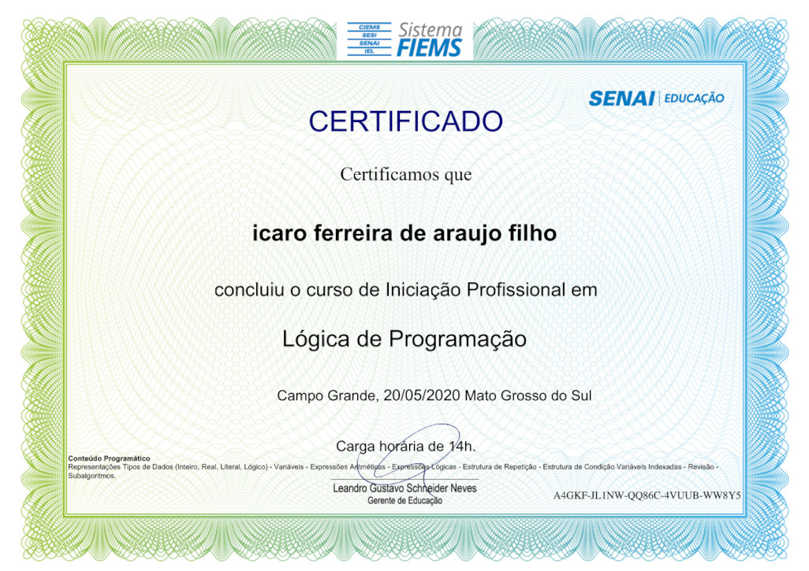

<header>
    
    <h1 align="center">Hello, I'm Ícaro Ferreira :wave: </h1>
</header>

<!-- About ME -->
<section>
    <h2>:man_technologist: About me</h2>
    <ul>
        <li>Bachelor of Aeronautical Science</li>
        <li>FullStack student at SENAI <a href="https://cursos.sesisenai.org.br/detalhes/devinhouse/25558">[DEVinHouse]</a></li>
        <li>Python Dev student at <a href="https://www.bylearn.com.br/">ByLearn</a></li>
        <li>Student mentor at <a href="https://www.estudonauta.com/">ESTUDONAUTA.COM </a>'s forum <small>(helping others student to code)</small></li>
        <li>Advanced English</li>
    </ul>
    

</section>

<!-- Skills -->
<section>
    <h2>:computer: Skills</h2>
    <!-- FRONT-END -->
    <table style="text-align: center">
        <th>HTML5</th>
        <th>CSS3</th>
        <th>JScript</th>
        <th>React</th>
        <tr>
        <td></td>
        <td></td>
        <td></td>
        <td></td>
        </tr>
    </table>
    <!-- BACK-END -->
    <table style="text-align: center">
        <th>Python</th>
        <th style="text-align: center">C#</th>
        <tr>
        <td></td>
        <td></td>
        </tr>
    </table>
    <!-- STORAGE -->
    <table style="text-align: center">
        <th>MySQL</th>
        <th>Postgre</th>
        <tr>
        <td></td>
        <td></td>
        </tr>
    </table>
    

    
        
    

</section>
<!-- FIND ME AROUND THE WORLD -->
<section>
    <h2>:world_map: Find me around the world</h2>
    <ul>
        <li><h4><strong>SOCIAL MEDIA</strong> 
        </h4>
            
            
            
            <!-- 
            <a href="https://th3devway.blogspot.com/" target="_blank">
                 -->
            </a>
          <!--   
            <a href="#" target="_blank">
                 -->
            </a>
            
            
        </li>
         
        <li><h4><strong>CHALLENGE PROFILE</strong> 
        </h4>
        
        
        
        </li>
    </ul>
    

</section>

<h2>📃Hackathon Certifications</h2> 

<!-- RECODEPRO -->
    
<strong>Recode Pro</strong>

    
    

<!-- Courses certifications -->
<h2>👨‍🎓Courses certifications</h2>

    
<strong>Estudonauta</strong>

    

    <!-- PROGRAMAÇÃO BASICA -->
        

            <h3>Programação Básica</h3>
            
            
            
            
            
            
            
            
            
            
            
            
        

        <!-- HTML/CSS -->
        

            <h3>HTML5 / CSS3</h3>
            
            
            
        

        <!-- JAVASCRIPT -->
        

            <h3>JavaScript</h3>
            
        

        <!-- C SHARP -->
        

            <h3>C#</h3>
            
            
            
        

        <!-- PYTHON -->
        

            <h3>Python</h3>
            
            
            
            
            
            
        

        <!-- MYSQL -->
        

            <h3>MySQL</h3>
            
        

        <!-- REDES -->
        

            <h3>Redes de Computadores</h3>
            
            
            
            
            
            
            
            
            
            
            
            
        

    

<!-- BOOTCAMPS -->
<section>
    <h2>📚Bootcamps Certifications</h2>
    <!-- DIGITAL INNOVATION ONE -->
    

        

            <strong>
                Digital Innovation One
                
            </strong>
        

        
        
        
        
        
        
    

    

    <!-- KENZIE ACADEMY -->
        

            <strong>
                Kenzie Academy
                
            </strong> 
        

        

            
            
            
            
            
            
            
            
             
        

    

    <!-- ESTAÇÃO HACK -->
    

        

            <strong>
                Estação Hack [Facebook] + Cel.Lep
                
            </strong>
        

        
        
        
        
        
        
         
    

    <!-- BYLEARN -->
    

        

            <strong>
                ByLearn
                
            </strong>
        

        
        
         
    

    <!-- TREINAWEB -->
    

        

            <strong>
                TreinaWeb
                
            </strong>
        

        
        
         
    

    <!-- SENAI -->
    

        

            <strong>
                Senai
                
            </strong>
        

        
        
        
        
         
    

    <!-- FLAI -->
    

        

            <strong>
                Flai
                
            </strong>
        

        
        
    

    <!-- CISCO -->
    

        

            <strong>
                Cisco
                
            </strong>
        

        
        
    

</section>

<!-- Public Repository -->
<section>
    <h2>Public Repository Index</h2>
    <!-- PYTHON ESTUDONAUTA -->
    

        
<strong>Python resolutions for Estudonauta</strong>

        <ul>
            <li>
                <label>Languages / Tecnologies used:  </label>
            </li>
            <li>
                Repository with all questions and resolutions of Estudonauta's python course. 
                All solutions were made with the content passed by its lesson (something that was not taught, will not be used) 
            </li>
            <li>
                <a href="https://github.com/icarofilho/estudonauta_python">[ Repo Link ]</a>
            </li>
        </ul>
    

    <!-- SENAI DEVINHOUSE -->
    

        
<strong>Senai - DEVinHouse [ Teltec - BRy ]</strong>

        <ul>
            <li>
                <label>Languages / Tecnologies used: 
                
                
                
                
                
                
                </label>
            </li>
            <li>
                Repository with all exercises and projects given during this course
            </li>
            <li>
                <a href="https://github.com/icarofilho/DEVinHouse-Teltec-BRy">[ Repo Link ]</a>
            </li>
        </ul>
    

    <!-- CHALLENGE -->
    

        
<strong>Challenge</strong>

        <ul>
            <li>
                <label>Languages / Tecnologies used: 
                
                
                
                </label>
            </li>
            <li>
                Solutions for HackerHank and CodeWars
            </li>
            <li>
                <a href="https://github.com/icarofilho/challenges">[ Repo Link ]</a>
            </li>
        </ul>
    

</section>